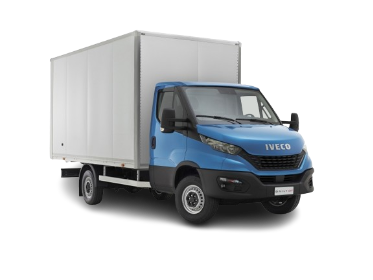
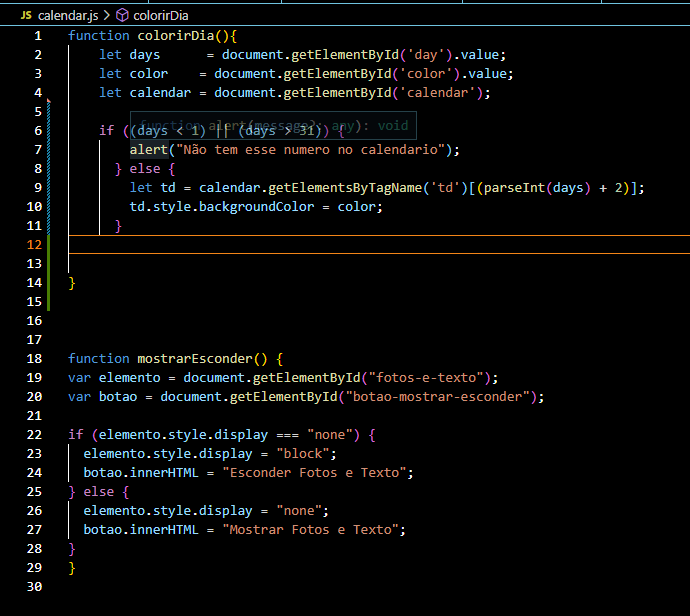
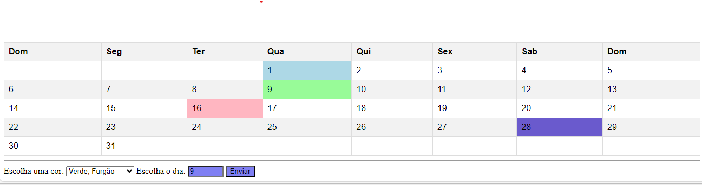

## CALENDARIO PARA FAZER SEUS PEDIDOS 

esse site foi criado com objetivo de fazer entragas para uma empresa que asta començando no mercado de trabalho, contendo apenas 4 transportes,
cada um pode fazer ate 5 entragas por dia você devera escoler a cor e cada cor tem um modelo de transporte.

 Modelos de tranportes que estão disponivels  
### iveco

### fiorino

### ranger

### forgão

# Estrutura do Site

## HTML 
>### contendo os elementos basicos do HTML como:
>
>* HTML
>* META
>* TH
>* DIV
>* TABLE
>* TR
>* IMG
## JavaScrit
 Tambem tem se usado javaScrit para persinalisar e estilisar o site, sendo um dos primeiros trabalhos com javaScrit  
 
 ### elementos do javaScrit:
 >* fumction
 >* let
 ### e funções como

 >* Days
 >* color 
 >* calendar
 >* td 
 >* document
 >* staly
 >* backgroundColor 
 >* color 

 

 ## css
 tendo usado css para estilisar mais o site.

 ### elementos usados:

 >*color
 >* th 
 >* td
 >* table
 >* option
 >* div 
 >* img
 

